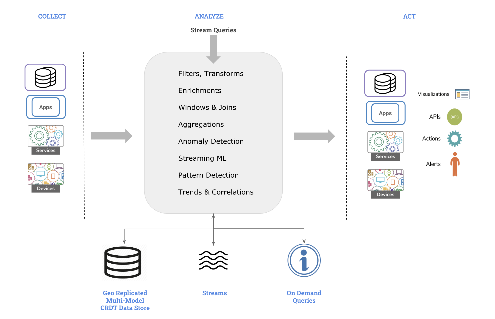

# Overview

Macrometa GDN allows you to integrate streaming data and take action based on streaming data. Typically the stream processing use cases involve collecting, analyzing and, integrate or acting on data generated during business activities by various sources i.e.,
 
| Stage | Description |
|-------|-------------|
| **Collect** | Receive or capture data from various data sources. |
| **Analyze** | Analyze data to identify interesting patterns and to extract information. |
| **Act** | Take actions based on the results and findings done via processing the data. The action can be executing some random code, calling an external service, or triggering a complex integration. |
| **Integrate** | Make processed data available for consumers to consume globally in right format with very low latencies. |

!!! note
		Stream Workers is currently an Enterprise only feature. We will be rolling it out to all users in Q1 of 2022.
		Please contact support@macrometa.com if you have any questions.	
## Architecture

The architecture of Macrometa stream processing engine fits this natural flow. Following are the major components of our stream processing engine.

The stream processing engine receives data event-by-event and processes them in real-time to produce meaningful information i.e.,

* Accept event inputs from many different types of sources.
* Process them to transform, enrich, and generate insights.
* Publish them to multiple types of sinks.

To use stream processor, you need to write the processing logic as a stream application using streaming SQL language which is discussed in the [Stream Query](query-guide.md). 

When the stream application is published, it:

1. Consumes data one-by-one as events.
2. Pipe the events to queries through various streams for processing.
3. Generates new events based on the processing done at the queries.
4. Finally, sends newly generated events through output to streams.

## Key Features

Macromete stream processing engine  allows you to write rich & complex stream processing logic using an intuitive SQL-like language. You can perform the following actions on the fly using stream queries and constructs.

| Feature | Description |
|---------| ------------|
| Realtime ETL | In realtime, extract data when available, transform it on the fly, and integrate it using sinks (http, streams, mqtt..) etc.|
| Consume & Publish Events | [Consume](query-guide.md#source) and [Publish](query-guide.md#sink) events via `Kafka`, `HTTP`, `TCP`, `MQTT`, `Amazon SQS`, `Google Pub/Sub`, `WebSocket`, `S3` and `Google Cloud Storage` |
| Data Filtering | [Filter](query-guide.md) events based on conditions such as value ranges, string matching, regex, and others.|
| Data Cleansing | Filter out corrupted, inaccurate or irrelevant data from a data stream based on one or more conditions. Modify or replace content to hide/remove unwanted data parts from a message (`e.g., obscuring`). Clean data by setting defaults, and handling nulls, using `default`, `if-then-else` functions, and many others. |
| Data Transformations | Support `data extraction` and `reconstruction of messages` using inline [mathematical and logical operations](query-guide.md),  inbuilt [functions](../extensions/#available-extensions) and custom functions in [`JavaScript`](query-guide.md) for processing `JSON`, `string`, `time`, `math`, `regex`, and others.|
| Data Enrichment | Enrich the data received in the stream with data from c8db or another data stream, or an external service to derive an expected result |
| Data Summarization | [Aggregate data](query-guide.md#aggregate-function) using `sum`, `count`, average (`avg`), `min`, `max`, `distinctCount`, and standard deviation (`StdDev`) operators. Summarize events based on time intervals like `sliding time`, `tumbling/batch time` [windows](query-guide.md#window) and based on number of events like `sliding length`, and `tumbling/batch length` [windows](query-guide.md#window). Support for data summarization based on `sessions` and `uniqueness`. Support for `named aggregation` and aggregation of data based on `group by fields`, `having` conditions. Sort & limit the aggregated output using `order by` and `limit` keywords.|
| Scripting | Write custom functions in [`JavaScript`](query-guide.md#script) and use within streaming queries. |
| Pattern & Trend Mining |  Identifies event `occurrence patterns` among streams over time. Identify `non occurrence` of events. Supports `repetitive matches` of event pattern occurrences with logical conditions and time bound. |
| Sequence Processing | Identifies continuous sequence of events from streams. Supports `zero to many`, `one to many`, and `zero to one` event matching conditions. |
| Scatter-Gather | Process complex messages by dividing them into simple messages using `tokenize` function, process or transform them in isolation, and group them back using the `batch` window and `group` aggregation. Ability to modularize the execution logic of each use case to build a composite event-driven applications. Provide execution isolation and parallel processing by `partitioning` the events using keys or value ranges. |
| Data Pipelines | Periodically trigger data pipelines based on time intervals, and cron expression using `triggers`. Support for calling `HTTP`services in a non-blocking manner to fetch data and enrich events. Handle responses accordingly for different response status codes. Divert the events to error stream to handle the errors gracefully.|
| Geo Replicated Data Store | Query, modify, and join the data stored in [tables](query-guide.md#table) which support primary key constraints and indexing. |
| Rule Processing | Execution of rules based on single event using [`filter`](query-guide.md#filter) operator, `if-then-else` and `match` [functions](query-guide.md#function), and many others. Rules based on collection of events using [data summarization](query-guide.md#aggregate-function), and joins with [streams](query-guide.md#join-stream), [tables](query-guide.md#join-table), [windows](query-guide.md#join-named-window) or [aggregations](query-guide.md#join-named-aggregation). Rules to detect event occurrence patterns, trends, or non-occurrence of a critical events using complex event processing constructs such as [`pattern`](query-guide.md#pattern), and [`sequence`](query-guide.md#sequence). |
| Realtime Decisions as Service | Provide [REST APIs](../rest-guides/on-demand-query-api/) to [query](query-guide.md#on-demand-query) `multi-modal geo-replicated tables`, `windows` and `named-aggregations` to make decisions based on the state of the system. |

These features allows you to build robust global data processing and integration pipelines at the edge by combining powerful stream processing, multi-model database and geo-replicated streams capabilities.
